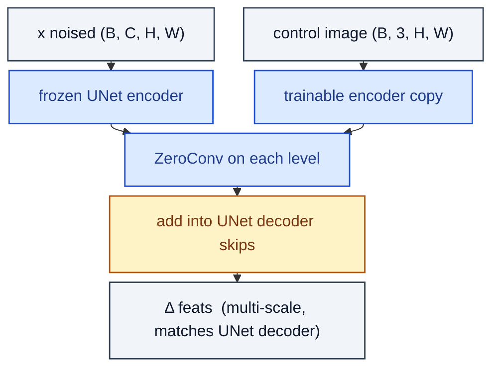

# ControlNetBlock

> Trainable copy of UNet encoder + ZeroConvs; outputs are added to the frozen UNet decoder.

**Shapes:** `x, control → ΔUNet decoder features`

**Used in**

- Stable Diffusion ControlNet (canny, depth, pose, scribble, etc.)
- ControlNet-XS — smaller variants for cheap inference

**Tasks**

- Adding structural conditioning (edges, depth, pose) to a pretrained diffusion model
- Fine-tuning T2I models on new control signals without forgetting the base distribution

**Common pitfalls**

- Frozen base U-Net must be EXACTLY the model you'll run at inference — fine-tunes of the base break compatibility.
- Zero-conv at the junction is essential; without it, training breaks the base model immediately.
- Each ControlNet is condition-specific — stacking many at inference is possible but quality drops.

**See also**

- [ControlNet (Zhang et al. 2023)](https://arxiv.org/abs/2302.05543)
- [T2I-Adapter (Mou et al. 2023)](https://arxiv.org/abs/2302.08453)
