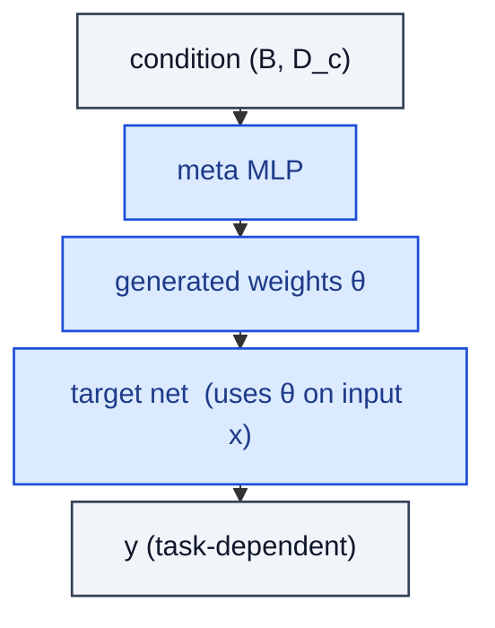

# HyperNetwork

> A meta-network that emits weights consumed by a target network.

**Shapes:** `cond:(B, D_c) → params → y`

**Used in**

- Stable Diffusion Hypernetworks (early SD fine-tuning trick)
- HyperNetworks (Ha et al. 2016) — original RNN-emitting-CNN-weights paper
- Meta-learning / few-shot adaptation

**Tasks**

- Conditioning a target network on a high-dimensional context by emitting its weights
- Few-shot personalisation in vision / text models

**Common pitfalls**

- Output dimension is the FULL parameter count of the target — grows quickly; usually emit low-rank or per-layer scalars instead.
- Joint optimisation is delicate — meta-LR usually much smaller than target-LR.
- Inference cost includes meta-net forward + target-net forward.

**See also**

- [HyperNetworks (Ha et al. 2016)](https://arxiv.org/abs/1609.09106)
