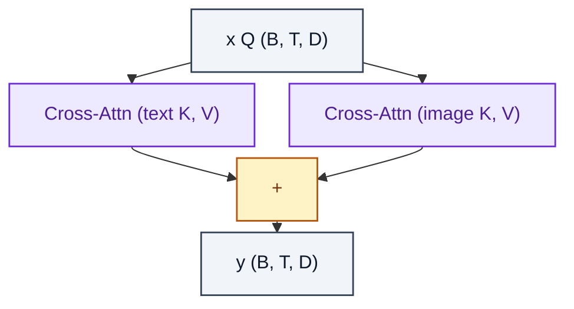

# IPAdapterCrossAttention

> Two parallel cross-attentions (text and image) summed into the residual stream.

**Shapes:** `x:(B, T, D), text/image features → (B, T, D)`

**Used in**

- IP-Adapter — image-prompt conditioning for Stable Diffusion
- IP-Adapter-FaceID, IP-Adapter-Plus variants

**Tasks**

- Conditioning a text-to-image diffusion model on a REFERENCE IMAGE prompt
- Image-prompted personalisation without per-subject fine-tuning

**Common pitfalls**

- Image and text branches use SEPARATE projections — sharing weights collapses modality.
- Image-branch scale (λ) is critical; high values overpower the text prompt.
- Reference encoder choice (CLIP ViT-L vs OpenCLIP H) changes downstream behaviour.

**See also**

- [IP-Adapter (Ye et al. 2023)](https://arxiv.org/abs/2308.06721)
