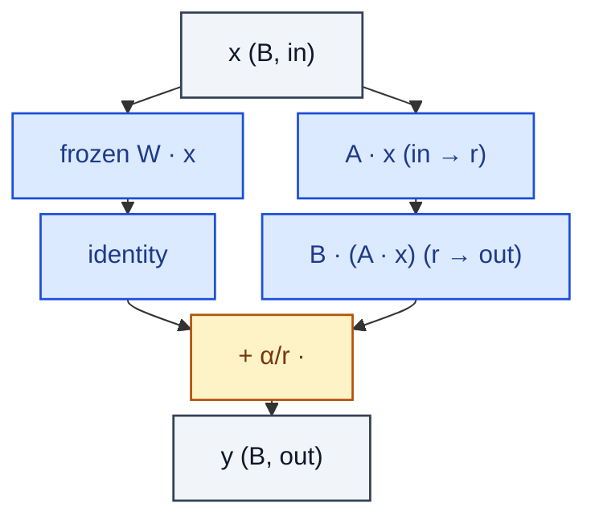

# LoRALinear

> Frozen linear plus a low-rank residual B·A·x scaled by α/r.

**Shapes:** `(B, in) → (B, out)`

**Used in**

- LoRA / QLoRA — LLM and diffusion fine-tuning
- PEFT library — Hugging Face standard
- SDXL LoRAs on civitai etc. for style/character training

**Tasks**

- Parameter-efficient fine-tuning (PEFT) — train < 1 % of parameters
- Composable / mergeable adapters that can be added on the fly

**Common pitfalls**

- A is init Gaussian, B init zero — swapping breaks the 'starts as identity' invariant.
- Rank r vs α/r scaling: doubling α at fixed r is equivalent to doubling learning rate.
- Merging LoRA back into frozen W (`W ← W + B·A·α/r`) is needed for inference speed.
- Stacking LoRAs at inference is additive — careful with cumulative drift.

**See also**

- [LoRA (Hu et al. 2021)](https://arxiv.org/abs/2106.09685)
- [QLoRA (Dettmers et al. 2023)](https://arxiv.org/abs/2305.14314)
