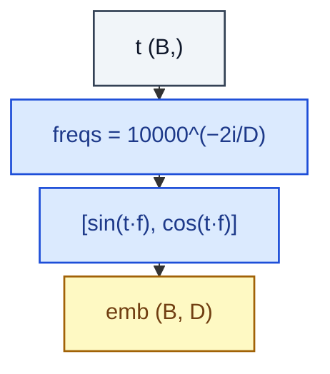

# SinusoidalTimeEmbedding

> Sin/cos positional embedding of the diffusion timestep t.

**Shapes:** `t:(B,) → emb:(B, D)`

**Used in**

- DDPM, DDIM, Stable Diffusion, Imagen — diffusion noise predictors
- Score-based generative models
- Continuous-time NeuralODE / flow-matching conditioning

**Tasks**

- Encoding a continuous scalar (timestep, noise level) into a vector for conditioning

**Common pitfalls**

- Frequency base (10000 in original Transformer; sometimes scaled differently for diffusion) affects which timescales are resolved — match the convention of the reference impl.
- When t is in [0, 1] vs [0, T] (T~1000) the same sinusoidal table behaves very differently.
- Half-precision can underflow for very small t — keep the embedding in fp32.

**See also**

- [DDPM (Ho et al. 2020)](https://arxiv.org/abs/2006.11239)
- [Attention Is All You Need (Vaswani et al. 2017)](https://arxiv.org/abs/1706.03762)
