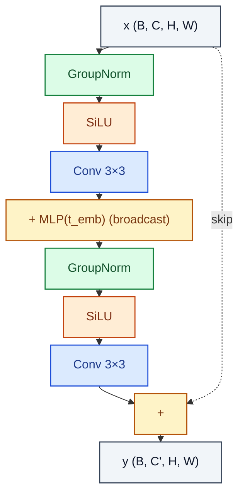

# UNetResBlock

> Residual block conditioned on a time embedding (added between the two convs).

**Shapes:** `x:(B, C, H, W), t:(B, D) → (B, C', H, W)`

**Used in**

- DDPM noise predictor
- Stable Diffusion U-Net (every resolution level)
- Latent video diffusion (SVD, AnimateDiff)

**Tasks**

- Time-conditioned feature extraction in a diffusion backbone

**Common pitfalls**

- Time embedding is added BETWEEN the two convs (not at the input) — placement matters.
- GroupNorm groups must divide channel count; 32 is standard, mismatches silently break.
- Skip connection must match channel count — add a 1×1 projection when C' ≠ C.

**See also**

- [DDPM (Ho et al. 2020)](https://arxiv.org/abs/2006.11239)
- [GroupNorm (Wu & He 2018)](https://arxiv.org/abs/1803.08494)
