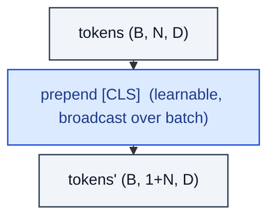

# CLSToken

> Prepend a learnable [CLS] token to each sequence (used as the global representation).

**Shapes:** `(B, N, D) → (B, 1+N, D)`

**Used in**

- BERT — [CLS] for sentence classification
- ViT, DeiT — image classification head reads only the CLS token
- DINO — CLS distillation between teacher and student

**Tasks**

- Producing a single global representation from a Transformer encoder
- Acting as a per-input prompt position when fine-tuning

**Common pitfalls**

- CLS pooling can be sub-optimal vs mean-pooling of patch tokens — verify empirically.
- When using register tokens (Darcet et al. 2023), additional learnable tokens reduce attention artefacts and may replace CLS for retrieval.
- Position embedding must reserve slot 0 for CLS — off-by-one bugs corrupt all positions.

**See also**

- [BERT (Devlin et al. 2018)](https://arxiv.org/abs/1810.04805)
- [ViT (Dosovitskiy et al. 2020)](https://arxiv.org/abs/2010.11929)
- [Register Tokens (Darcet et al. 2023)](https://arxiv.org/abs/2309.16588)
