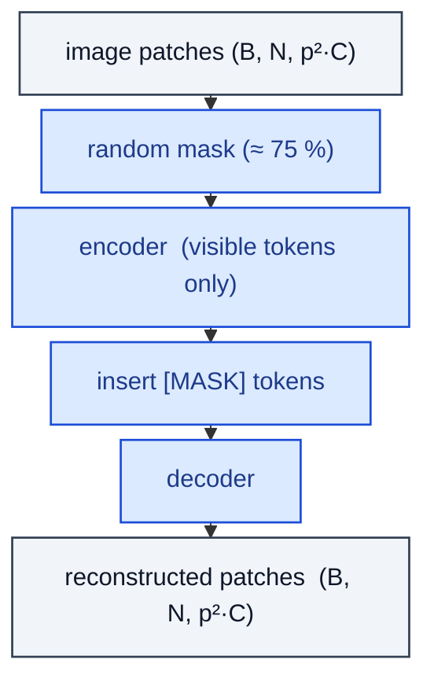

# MaskedImageModeling

> MAE/BEiT objective: random-mask patches, encode visible tokens, reconstruct.

**Shapes:** `(B, N, D) → masked, (B, N, p²·C) reconstructed`

**Used in**

- MAE — Masked Autoencoders pre-training (He et al. 2021)
- BEiT v1 / v2 — predicts discrete tokens instead of pixels
- VideoMAE, SiT — video and audio extensions

**Tasks**

- Self-supervised pre-training of Vision Transformers
- Few-label fine-tuning where labeled data is scarce

**Common pitfalls**

- 75 % masking ratio is empirically best for images; lower ratios under-train the encoder.
- Decoder is intentionally tiny — making it deeper does NOT help downstream tasks.
- Pixel-reconstruction loss is unnormalised — pre-normalise patches for stable training.
- Heavy memory at sequence-level reordering; tensor-shuffle indexing is easy to get wrong.

**See also**

- [MAE (He et al. 2021)](https://arxiv.org/abs/2111.06377)
- [BEiT (Bao et al. 2021)](https://arxiv.org/abs/2106.08254)
- [VideoMAE (Tong et al. 2022)](https://arxiv.org/abs/2203.12602)
