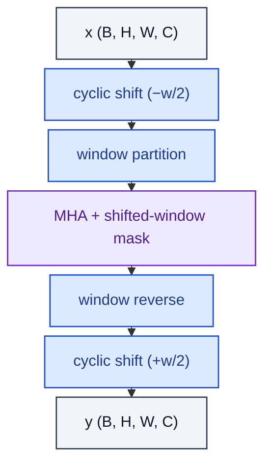

# ShiftedWindowAttention

> Cyclic-shift variant that lets adjacent windows exchange information.

**Shapes:** `(B, N, C) → (B, N, C)  with implicit (H, W)`

**Used in**

- Swin Transformer's odd-numbered blocks (SW-MSA after W-MSA)
- Hybrid CNN-transformer detectors using Swin as backbone

**Tasks**

- Letting adjacent windows exchange tokens without paying global-attention cost

**Common pitfalls**

- The shift mask is non-trivial — getting the connectivity wrong silently halves quality.
- Cyclic shift must be exactly undone after attention; off-by-one rolls leak features.
- Combine carefully with relative position bias — shift changes which (i,j) pairs are valid.

**See also**

- [Swin Transformer (Liu et al. 2021)](https://arxiv.org/abs/2103.14030)
