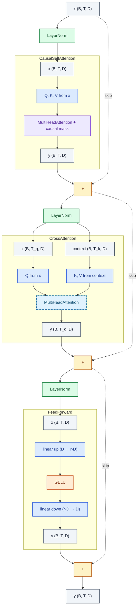

# TransformerDecoderBlock

> Pre-norm decoder: causal self-attn, cross-attn over context, FFN.

**Shapes:** `x:(B, T, D), ctx:(B, M, D) → (B, T, D)`

```mermaid
flowchart TD
    n0_0["x  (B, T, D)"]:::io
    n1_0["LayerNorm"]:::norm
    subgraph n2_0["CausalSelfAttention"]
        n2_0_0_0["x  (B, T, D)"]:::io
        n2_0_1_0["Q, K, V from x"]:::op
        n2_0_2_0["MultiHeadAttention + causal mask"]:::attn
        n2_0_3_0["y  (B, T, D)"]:::io
        n2_0_0_0 --> n2_0_1_0
        n2_0_1_0 --> n2_0_2_0
        n2_0_2_0 --> n2_0_3_0
    end
    n3_0["+"]:::merge
    n4_0["LayerNorm"]:::norm
    subgraph n5_0["CrossAttention"]
        n5_0_0_0["x  (B, T_q, D)"]:::io
        n5_0_0_1["context  (B, T_k, D)"]:::io
        n5_0_1_0["Q from x"]:::op
        n5_0_1_1["K, V from context"]:::op
        n5_0_2_0["MultiHeadAttention"]:::ref
        n5_0_3_0["y  (B, T_q, D)"]:::io
        n5_0_0_0 --> n5_0_1_0
        n5_0_0_1 --> n5_0_1_1
        n5_0_1_0 --> n5_0_2_0
        n5_0_1_1 --> n5_0_2_0
        n5_0_2_0 --> n5_0_3_0
    end
    n6_0["+"]:::merge
    n7_0["LayerNorm"]:::norm
    subgraph n8_0["FeedForward"]
        n8_0_0_0["x  (B, T, D)"]:::io
        n8_0_1_0["linear up  (D → r·D)"]:::op
        n8_0_2_0["GELU"]:::act
        n8_0_3_0["linear down  (r·D → D)"]:::op
        n8_0_4_0["y  (B, T, D)"]:::io
        n8_0_0_0 --> n8_0_1_0
        n8_0_1_0 --> n8_0_2_0
        n8_0_2_0 --> n8_0_3_0
        n8_0_3_0 --> n8_0_4_0
    end
    n9_0["+"]:::merge
    n10_0["y  (B, T, D)"]:::io
    n0_0 --> n1_0
    n1_0 --> n2_0_0_0
    n2_0_3_0 --> n3_0
    n3_0 --> n4_0
    n4_0 --> n5_0_0_0
    n4_0 --> n5_0_0_1
    n5_0_3_0 --> n6_0
    n6_0 --> n7_0
    n7_0 --> n8_0_0_0
    n8_0_4_0 --> n9_0
    n9_0 --> n10_0
    n0_0 -. skip .-> n3_0
    n3_0 -. skip .-> n6_0
    n6_0 -. skip .-> n9_0
    classDef io fill:#f1f5f9,stroke:#334155,stroke-width:1.4px,color:#0f172a
    classDef op fill:#dbeafe,stroke:#1d4ed8,stroke-width:1.4px,color:#1e3a8a
    classDef norm fill:#dcfce7,stroke:#15803d,stroke-width:1.4px,color:#14532d
    classDef act fill:#ffedd5,stroke:#c2410c,stroke-width:1.4px,color:#7c2d12
    classDef attn fill:#ede9fe,stroke:#6d28d9,stroke-width:1.4px,color:#4c1d95
    classDef merge fill:#fef3c7,stroke:#b45309,stroke-width:1.4px,color:#78350f
    classDef emb fill:#fef9c3,stroke:#a16207,stroke-width:1.4px,color:#713f12
    classDef loss fill:#fee2e2,stroke:#b91c1c,stroke-width:1.4px,color:#7f1d1d
    classDef ctrl fill:#f5f5f4,stroke:#52525b,stroke-width:1.4px,color:#27272a
    classDef ref fill:#e0f2fe,stroke:#0369a1,stroke-width:2px,color:#0c4a6e,stroke-dasharray: 4 2
```
