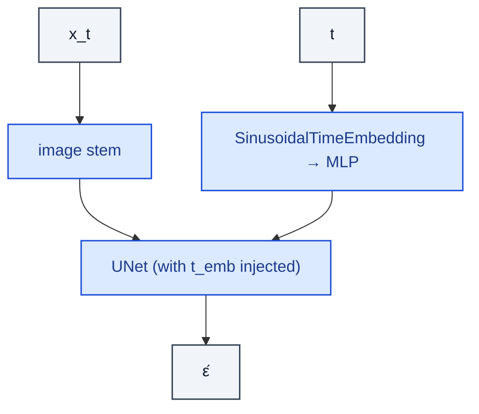

# NoisePredictor

> End-to-end ε-prediction network used by DDPM/DDIM samplers.

**Shapes:** `x_t:(B, C, H, W), t:(B,) → ε̂:(B, C, H, W)`

```mermaid
flowchart TD
    n0_0["x_t"]:::io
    n0_1["t"]:::io
    n1_0["image stem"]:::op
    n1_1["SinusoidalTimeEmbedding → MLP"]:::op
    n2_0["UNet (with t_emb injected)"]:::op
    n3_0["ε̂"]:::io
    n0_0 --> n1_0
    n0_1 --> n1_1
    n1_0 --> n2_0
    n1_1 --> n2_0
    n2_0 --> n3_0
    classDef io fill:#f1f5f9,stroke:#334155,stroke-width:1.4px,color:#0f172a
    classDef op fill:#dbeafe,stroke:#1d4ed8,stroke-width:1.4px,color:#1e3a8a
    classDef norm fill:#dcfce7,stroke:#15803d,stroke-width:1.4px,color:#14532d
    classDef act fill:#ffedd5,stroke:#c2410c,stroke-width:1.4px,color:#7c2d12
    classDef attn fill:#ede9fe,stroke:#6d28d9,stroke-width:1.4px,color:#4c1d95
    classDef merge fill:#fef3c7,stroke:#b45309,stroke-width:1.4px,color:#78350f
    classDef emb fill:#fef9c3,stroke:#a16207,stroke-width:1.4px,color:#713f12
    classDef loss fill:#fee2e2,stroke:#b91c1c,stroke-width:1.4px,color:#7f1d1d
    classDef ctrl fill:#f5f5f4,stroke:#52525b,stroke-width:1.4px,color:#27272a
```
