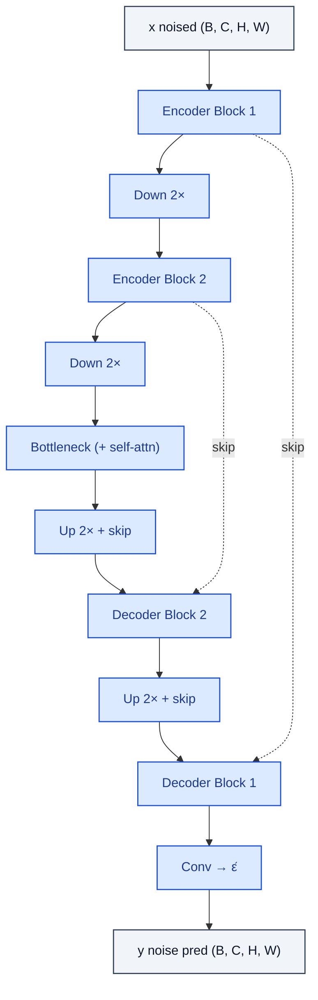

# UNet

> Encoder-decoder with skip connections at matching resolutions; bottleneck attention.

**Shapes:** `(B, C, H, W) → (B, C, H, W)`

```mermaid
flowchart TD
    n0_0["x  noised  (B, C, H, W)"]:::io
    n1_0["Encoder Block 1"]:::op
    n2_0["Down 2×"]:::op
    n3_0["Encoder Block 2"]:::op
    n4_0["Down 2×"]:::op
    n5_0["Bottleneck (+ self-attn)"]:::op
    n6_0["Up 2×  + skip"]:::op
    n7_0["Decoder Block 2"]:::op
    n8_0["Up 2×  + skip"]:::op
    n9_0["Decoder Block 1"]:::op
    n10_0["Conv → ε̂"]:::op
    n11_0["y  noise pred  (B, C, H, W)"]:::io
    n0_0 --> n1_0
    n1_0 --> n2_0
    n2_0 --> n3_0
    n3_0 --> n4_0
    n4_0 --> n5_0
    n5_0 --> n6_0
    n6_0 --> n7_0
    n7_0 --> n8_0
    n8_0 --> n9_0
    n9_0 --> n10_0
    n10_0 --> n11_0
    n1_0 -. skip .-> n9_0
    n3_0 -. skip .-> n7_0
    classDef io fill:#f1f5f9,stroke:#334155,stroke-width:1.4px,color:#0f172a
    classDef op fill:#dbeafe,stroke:#1d4ed8,stroke-width:1.4px,color:#1e3a8a
    classDef norm fill:#dcfce7,stroke:#15803d,stroke-width:1.4px,color:#14532d
    classDef act fill:#ffedd5,stroke:#c2410c,stroke-width:1.4px,color:#7c2d12
    classDef attn fill:#ede9fe,stroke:#6d28d9,stroke-width:1.4px,color:#4c1d95
    classDef merge fill:#fef3c7,stroke:#b45309,stroke-width:1.4px,color:#78350f
    classDef emb fill:#fef9c3,stroke:#a16207,stroke-width:1.4px,color:#713f12
    classDef loss fill:#fee2e2,stroke:#b91c1c,stroke-width:1.4px,color:#7f1d1d
    classDef ctrl fill:#f5f5f4,stroke:#52525b,stroke-width:1.4px,color:#27272a
    classDef ref fill:#e0f2fe,stroke:#0369a1,stroke-width:2px,color:#0c4a6e,stroke-dasharray: 4 2
```
